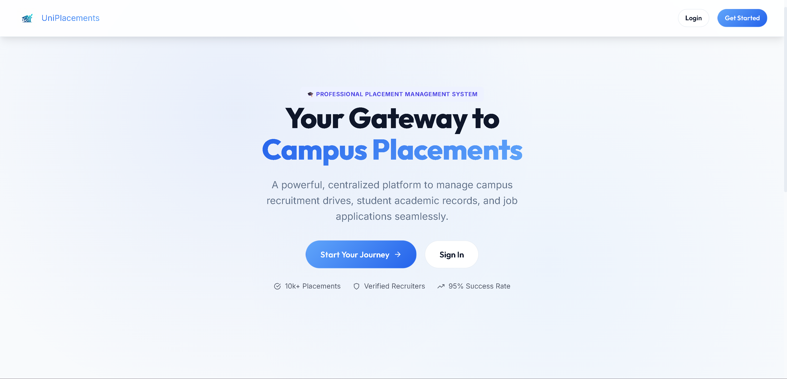
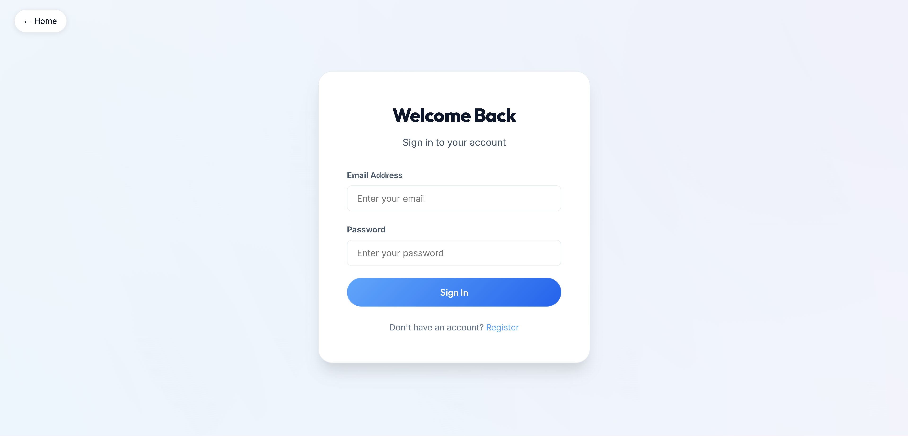
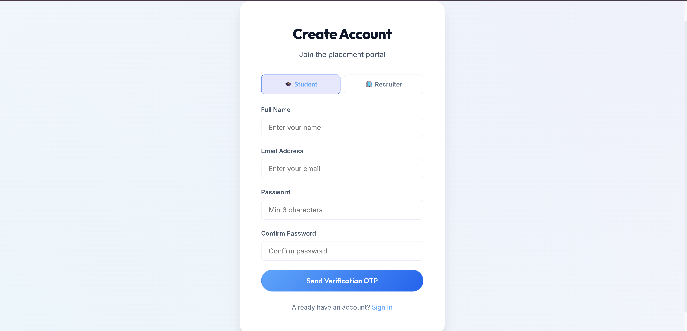
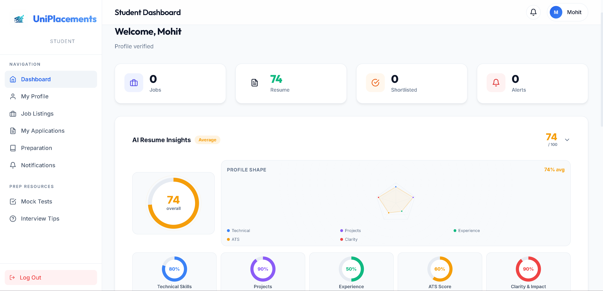
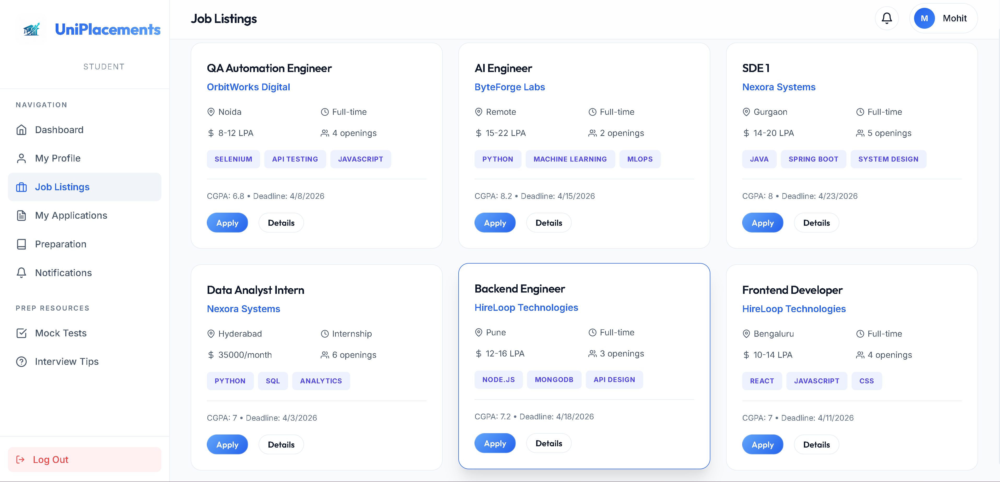
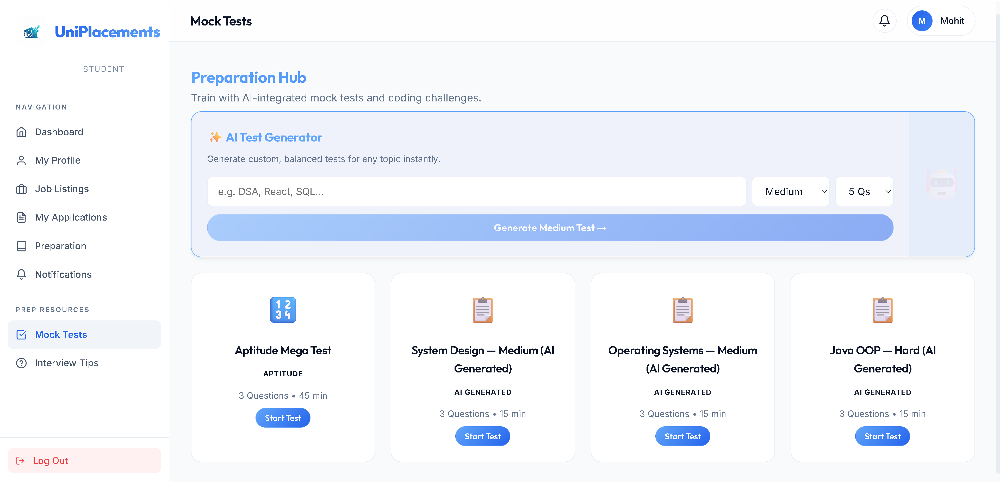
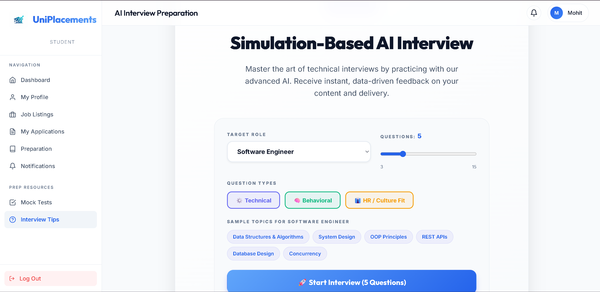
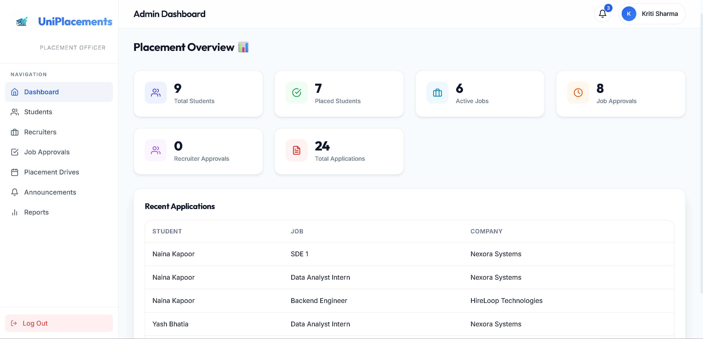

# 🎓 University Placement & Preparation Portal

[](https://opensource.org/licenses/MIT)
[](http://makeapullrequest.com)
[](https://github.com/diksha12345612/University-Placement-Management-System)
[](https://university-placement-portal-seven.vercel.app)
[](https://university-placement-portal-seven.vercel.app/api)
[](https://react.dev/)
[](https://nodejs.org/)

A comprehensive full-stack platform designed to bridge the gap between students, recruiters, and placement officers. This portal streamlines the recruitment lifecycle while empowering students with AI-driven preparation tools.

---

## 🚀 Vision
PlacePrep centralizes the university placement process—moving away from scattered spreadsheets and manual tracking to a unified, digital-first workspace. It helps students prepare for their dream careers while providing recruiters with powerful tools to find the right talent.

---

## 🟢 Live Deployment
- **Primary Web App:** [https://university-placement-portal-seven.vercel.app](https://university-placement-portal-seven.vercel.app)
- **Production API Base:** [https://university-placement-portal-seven.vercel.app/api](https://university-placement-portal-seven.vercel.app/api)

### Demo Credentials
- **Admin:** Contact the project owner for demo account details
- **Demo student and recruiter accounts:** Use the seed script to generate test accounts in your local environment

---

## 🖼️ Project Visuals

### Frontpage



### Sign In Page



### Register Page



### Student Dashboard



### Job Listings



### Mock Test Page



### Interview Prep



### Admin Page



---

## ✨ Key Features

### For Students 🎓
- **📊 Personalized Dashboard**: Real-time tracking of applications and upcoming placement drives.
- **🔍 Smart Job Finder**: Advanced filtering and eligibility checks for job roles.
- **📄 Resume Upload + ATS Analysis**: AI-powered scoring with criteria-wise breakdown and targeted resume improvements.
- **💡 AI Preparation Hub**:
  - **Structured DSA Roadmap**: A curated 8-week guide for coding excellence.
  - **Practice Portals**: Topic-wise coding challenges and theoretical concepts.
  - **AI Mock Tests**: Timed assessments with instant feedback.
  - **AI Interview Prep + Evaluation**: Role-based questions, detailed feedback, model answers, and improvement tips.
  - **Skip-to-Next Interview Question Flow**: Move to the next prompt when you want to pass a question.
  - **AI Career Mentor Roadmap**: Role-focused multi-phase preparation plans.

### For Recruiters 🏢
- **💼 Job Lifecycle Management**: Post roles, define eligibility, and track applications.
- **📄 Applicant Tracking System (ATS)**: Streamlined student profile reviews and resume management.
- **⚡ Status Management**: Instant Shortlist/Reject/Select actions for candidates.
- **🧠 AI Candidate Fit Support**: Automated matching insights to assist screening quality.

### For Administrators (TPO) 📊
- **✅ Verification System**: Profile and job posting approval workflows.
- **📢 Broadcaster**: Schedule drives and broadcast announcements to the entire student body.
- **📈 Advanced Analytics**: Visual insights into placement trends and company participation.
- **🧪 Demo Data Ready**: Seed scripts for realistic students, recruiters, jobs, and applications.

---

## 🧠 AI Capabilities
Integrated with **OpenAI** and **OpenRouter**, the portal provides:
- **Resume Analysis**: Instant scoring and improvement suggestions.
- **AI Interviewer**: Context-aware questioning based on the job role and student profile.
- **Evaluation Engine**: Automated feedback on student technical and interpersonal performance.
- **Fallback Handling**: Provider fallback and safe response normalization for better reliability.

---

## 🛠️ Technology Stack
- **Frontend**: React.js, Vite, React Router, Axios, React Hot Toast.
- **Backend**: Node.js, Express.js.
- **Database**: MongoDB (Mongoose).
- **AI Service**: OpenAI / OpenRouter.
- **Authentication**: JWT-based RBAC (Role-Based Access Control).

---

## 📂 Project Structure
```bash
University-Placement-System/
├── client/              # React.js Frontend (Vite)
│   ├── src/
│   │   ├── components/  # Atomic UI elements
│   │   ├── pages/       # View modules for Student, Recruiter, Admin
│   │   ├── context/     # Global state (Auth/AI)
│   │   └── services/    # API abstraction layer
├── server/              # Express.js Backend
│   ├── models/          # MongoDB Schemas & Validation
│   ├── routes/          # API Gateway
│   ├── services/        # AI & Business logic
│   └── middleware/      # Auth & File processing
└── data/                # Sample datasets & seeds
```

---

## 🏁 Getting Started

### 1. Setup Backend
```bash
cd server
npm install
# Configure your .env (GITHUB_TOKEN or OPENAI_API_KEY, OPENROUTER_API_KEY, MONGODB_URI)
npm run seed     # Populate database
npm run dev      # Server starts on port 5000
```

### 2. Setup Frontend
```bash
cd client
npm install
npm run dev      # App starts on port 5173
```

### Optional Full Demo Reset
```bash
cd server
npm run seed:full-reset
```

---

## 🤝 Contributing
Contributions are what make the open source community such an amazing place to learn, inspire, and create.
1. Fork the Project
2. Create your Feature Branch (`git checkout -b feature/AmazingFeature`)
3. Commit your Changes (`git commit -m 'Add some AmazingFeature'`)
4. Push to the Branch (`git push origin feature/AmazingFeature`)
5. Open a Pull Request

---

## 📜 License
Distributed under the MIT License. See `LICENSE` for more information.

---

*Built with ❤️ for better career outcomes.*
